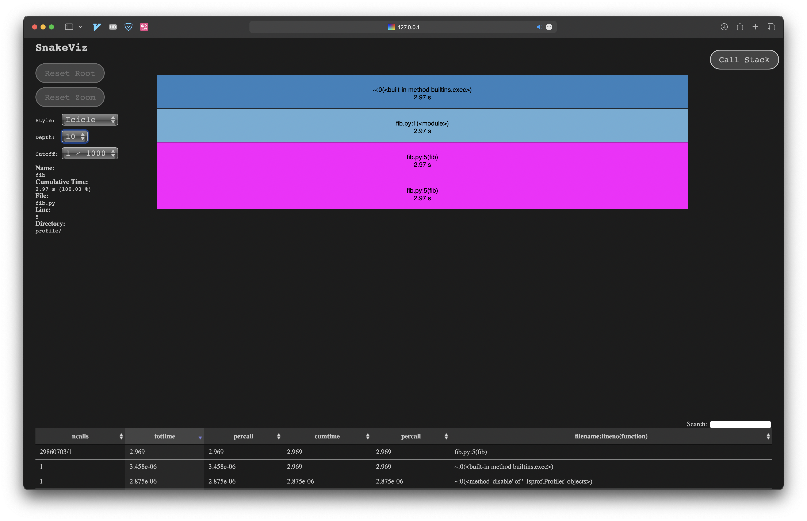
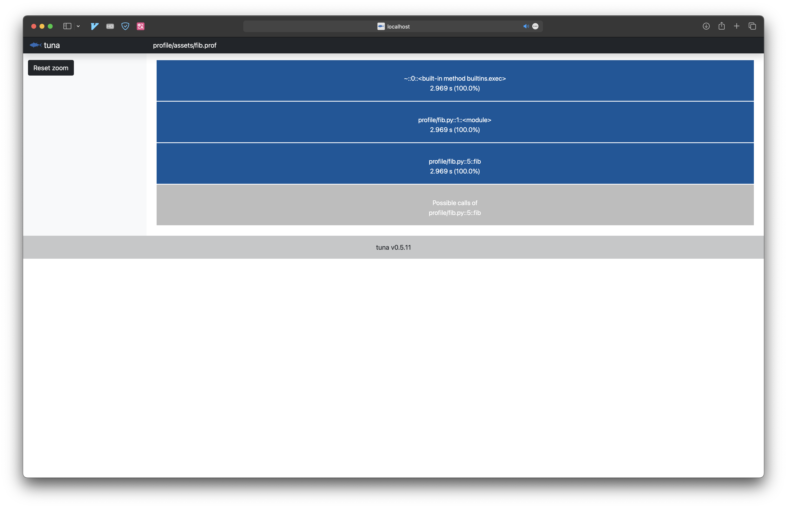
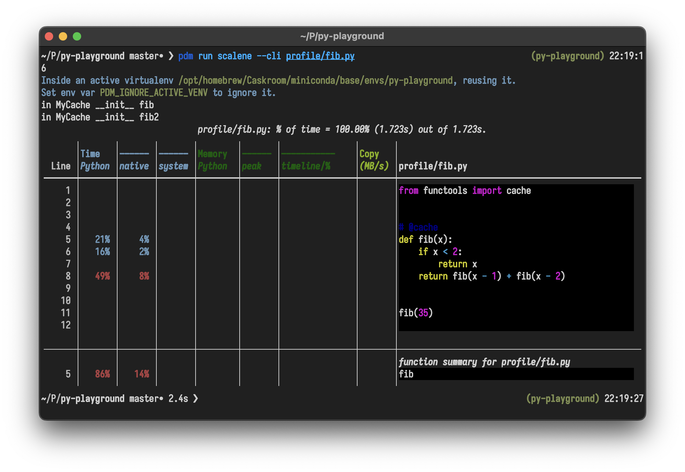
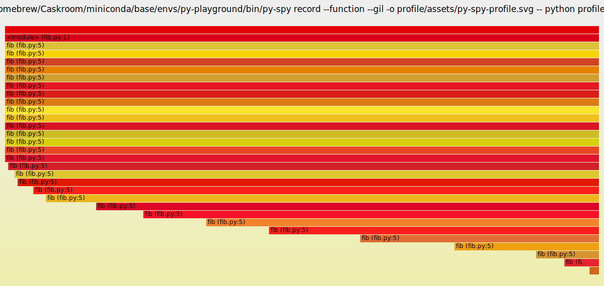

# profile

## cProfile

```sh
pdm run profile/c_profile.py
```

```sh
         44 function calls (9 primitive calls) in 0.000 seconds

   Ordered by: cumulative time

   ncalls  tottime  percall  cumtime  percall filename:lineno(function)
     36/1    0.000    0.000    0.000    0.000 /Users/yifanwu/Projects/py-playground/profile/c_profile.py:6(fib)
        1    0.000    0.000    0.000    0.000 /Users/yifanwu/.pyenv/versions/3.9.9/lib/python3.9/pstats.py:107(__init__)
        1    0.000    0.000    0.000    0.000 /Users/yifanwu/.pyenv/versions/3.9.9/lib/python3.9/pstats.py:117(init)
        1    0.000    0.000    0.000    0.000 /Users/yifanwu/.pyenv/versions/3.9.9/lib/python3.9/pstats.py:136(load_stats)
        1    0.000    0.000    0.000    0.000 /Users/yifanwu/.pyenv/versions/3.9.9/lib/python3.9/cProfile.py:50(create_stats)
        1    0.000    0.000    0.000    0.000 {built-in method builtins.isinstance}
        1    0.000    0.000    0.000    0.000 {built-in method builtins.hasattr}
        1    0.000    0.000    0.000    0.000 {built-in method builtins.len}
        1    0.000    0.000    0.000    0.000 {method 'disable' of '_lsprof.Profiler' objects}
```

```sh
pdm run python -m cProfile profile/fib.py
```

```sh
         29860706 function calls (4 primitive calls) in 3.240 seconds

   Ordered by: standard name

   ncalls  tottime  percall  cumtime  percall filename:lineno(function)
        1    0.000    0.000    3.240    3.240 fib.py:1(<module>)
29860703/1    3.240    0.000    3.240    3.240 fib.py:5(fib)
        1    0.000    0.000    3.240    3.240 {built-in method builtins.exec}
        1    0.000    0.000    0.000    0.000 {method 'disable' of '_lsprof.Profiler' objects}
```

dump the output

```sh
pdm run python -m cProfile -o profile/assets/fib.prof profile/fib.py
```

### viz with [SnakeViz](https://github.com/jiffyclub/snakeviz)

```sh
pdm run snakeviz profile/assets/fib.prof
```



### viz with [tuna](https://github.com/nschloe/tuna)

```sh
pdm run tuna profile/assets/fib.prof
```



## [line-profiler](https://github.com/pyutils/line_profiler)

```sh
pdm run kernprof -lv profile/lp_profile.py
```

```sh
Wrote profile results to lp_profile.py.lprof
Timer unit: 1e-06 s

Total time: 1.9e-05 s
File: profile/lp_profile.py
Function: fib at line 4

Line #      Hits         Time  Per Hit   % Time  Line Contents
==============================================================
     4                                           @cache
     5                                           @profile
     6                                           def fib(x):
     7        29          1.0      0.0      5.3      if x < 2:
     8         2          1.0      0.5      5.3          return x
     9        29         17.0      0.6     89.5      return fib(x - 1) + fib(x - 2)
```

## [scalene](https://github.com/plasma-umass/scalene)

```sh
pdm run scalene --cli profile/fib.py
```



## [py-spy](https://github.com/benfred/py-spy)

```sh
sudo pdm run py-spy record --function --gil -o profile/assets/py-spy-profile.svg -- python profile/fib.py
```



## multi-threading

```sh
pdm run python -m cProfile profile/thread/fib.py
```

```sh
         73828786 function calls (8707 primitive calls) in 9.314 seconds

   Ordered by: cumulative time

   ncalls  tottime  percall  cumtime  percall filename:lineno(function)
   104/80    0.000    0.000   18.612    0.233 {method 'acquire' of '_thread.lock' objects}
        6    0.000    0.000   18.612    3.102 threading.py:1115(join)
        6    0.000    0.000   18.612    3.102 threading.py:1153(_wait_for_tstate_lock)
        7    0.000    0.000   17.119    2.446 _base.py:199(as_completed)
       12    0.000    0.000   17.119    1.427 threading.py:637(wait)
       18    0.000    0.000   17.119    0.951 threading.py:323(wait)
     11/1    0.000    0.000    9.314    9.314 {built-in method builtins.exec}
        1    0.000    0.000    9.314    9.314 fib.py:1(<module>)
        1    0.000    0.000    9.309    9.309 fib.py:10(main)
        1    0.000    0.000    9.309    9.309 _base.py:646(__exit__)
        1    0.000    0.000    9.309    9.309 thread.py:219(shutdown)
      6/1    0.000    0.000    9.309    9.309 threading.py:1016(_bootstrap)
      6/1    0.000    0.000    9.309    9.309 threading.py:1056(_bootstrap_inner)
      6/1    0.000    0.000    9.309    9.309 threading.py:999(run)
      6/1    0.000    0.000    9.309    9.309 thread.py:69(_worker)
      6/1    0.000    0.000    9.309    9.309 {method 'get' of '_queue.SimpleQueue' objects}
      6/1    0.000    0.000    9.302    9.302 thread.py:53(run)
73819714/1    9.307    0.000    9.302    9.302 fib.py:4(fib)
        3    0.000    0.000    0.006    0.002 __init__.py:1(<module>)
     14/2    0.000    0.000    0.005    0.002 <frozen importlib._bootstrap>:1349(_find_and_load)
     14/2    0.000    0.000    0.005    0.002 <frozen importlib._bootstrap>:1304(_find_and_load_unlocked)
     31/5    0.000    0.000    0.005    0.001 <frozen importlib._bootstrap>:480(_call_with_frames_removed)
     14/3    0.000    0.000    0.005    0.002 <frozen importlib._bootstrap>:911(_load_unlocked)
     10/3    0.000    0.000    0.005    0.002 <frozen importlib._bootstrap_external>:989(exec_module)
        1    0.000    0.000    0.003    0.003 _base.py:1(<module>)
       55    0.000    0.000    0.001    0.000 {built-in method builtins.__build_class__}
        4    0.000    0.000    0.001    0.000 __init__.py:226(compile)
        4    0.000    0.000    0.001    0.000 __init__.py:280(_compile)
        4    0.000    0.000    0.001    0.000 _compiler.py:740(compile)
       10    0.000    0.000    0.001    0.000 <frozen importlib._bootstrap_external>:1062(get_code)
    86/73    0.000    0.000    0.001    0.000 {built-in method builtins.hasattr}
      4/2    0.000    0.000    0.001    0.000 <frozen importlib._bootstrap>:1390(_handle_fromlist)
        1    0.000    0.000    0.001    0.001 __init__.py:40(__getattr__)
        1    0.000    0.000    0.001    0.001 thread.py:1(<module>)
       10    0.000    0.000    0.001    0.000 <frozen importlib._bootstrap_external>:751(_compile_bytecode)
        4    0.000    0.000    0.001    0.000 _parser.py:969(parse)
       14    0.000    0.000    0.001    0.000 <frozen importlib._bootstrap>:1240(_find_spec)
     20/4    0.000    0.000    0.001    0.000 _parser.py:452(_parse_sub)
     29/4    0.000    0.000    0.001    0.000 _parser.py:512(_parse)
       10    0.001    0.000    0.001    0.000 {built-in method marshal.loads}
        1    0.000    0.000    0.001    0.001 queue.py:1(<module>)
       12    0.000    0.000    0.001    0.000 <frozen importlib._bootstrap_external>:1517(find_spec)
        4    0.000    0.000    0.001    0.000 _compiler.py:573(_code)
       12    0.000    0.000    0.001    0.000 <frozen importlib._bootstrap_external>:1488(_get_spec)
        1    0.000    0.000    0.001    0.001 __init__.py:469(StrFormatStyle)
        1    0.000    0.000    0.001    0.001 string.py:1(<module>)
     61/4    0.000    0.000    0.001    0.000 _compiler.py:37(_compile)
       32    0.000    0.000    0.000    0.000 <frozen importlib._bootstrap_external>:1590(find_spec)
        1    0.000    0.000    0.000    0.000 string.py:69(__init_subclass__)
        6    0.000    0.000    0.000    0.000 _base.py:537(set_result)
       14    0.000    0.000    0.000    0.000 <frozen importlib._bootstrap>:806(module_from_spec)
        1    0.000    0.000    0.000    0.000 __init__.py:436(PercentStyle)
       20    0.000    0.000    0.000    0.000 _compiler.py:243(_optimize_charset)
        2    0.000    0.000    0.000    0.000 <frozen importlib._bootstrap_external>:1287(create_module)
        2    0.000    0.000    0.000    0.000 {built-in method _imp.create_dynamic}
        1    0.000    0.000    0.000    0.000 {built-in method builtins.__import__}
       10    0.000    0.000    0.000    0.000 <frozen importlib._bootstrap_external>:1183(get_data)
        1    0.000    0.000    0.000    0.000 heapq.py:1(<module>)
        6    0.000    0.000    0.000    0.000 _base.py:81(add_result)
        6    0.000    0.000    0.000    0.000 {built-in method builtins.print}
        6    0.000    0.000    0.000    0.000 thread.py:164(submit)
       13    0.000    0.000    0.000    0.000 threading.py:616(set)
       19    0.000    0.000    0.000    0.000 threading.py:424(notify_all)
      166    0.000    0.000    0.000    0.000 <frozen importlib._bootstrap_external>:126(_path_join)
        6    0.000    0.000    0.000    0.000 thread.py:183(_adjust_thread_count)
        1    0.000    0.000    0.000    0.000 threading.py:1(<module>)
       69    0.000    0.000    0.000    0.000 <frozen importlib._bootstrap_external>:140(_path_stat)
        1    0.000    0.000    0.000    0.000 traceback.py:1(<module>)
       14    0.000    0.000    0.000    0.000 <frozen importlib._bootstrap>:416(__enter__)
       69    0.000    0.000    0.000    0.000 {built-in method posix.stat}
       10    0.000    0.000    0.000    0.000 {built-in method _io.open_code}
        2    0.000    0.000    0.000    0.000 __init__.py:355(namedtuple)
        6    0.000    0.000    0.000    0.000 threading.py:973(start)
       25    0.000    0.000    0.000    0.000 threading.py:394(notify)
       14    0.000    0.000    0.000    0.000 <frozen importlib._bootstrap>:733(_init_module_attrs)
      431    0.000    0.000    0.000    0.000 _parser.py:261(get)
      349    0.000    0.000    0.000    0.000 _parser.py:168(__getitem__)
        6    0.000    0.000    0.000    0.000 {built-in method _thread.start_new_thread}
       14    0.000    0.000    0.000    0.000 <frozen importlib._bootstrap>:304(acquire)
       20    0.000    0.000    0.000    0.000 <frozen importlib._bootstrap_external>:482(cache_from_source)
       67    0.000    0.000    0.000    0.000 threading.py:299(__enter__)
  705/641    0.000    0.000    0.000    0.000 {built-in method builtins.len}
    74/17    0.000    0.000    0.000    0.000 _parser.py:178(getwidth)
       41    0.000    0.000    0.000    0.000 <frozen importlib._bootstrap_external>:1466(_path_importer_cache)
       22    0.000    0.000    0.000    0.000 <frozen importlib._bootstrap>:632(cached)
       21    0.000    0.000    0.000    0.000 <frozen importlib._bootstrap_external>:159(_path_isfile)
       24    0.000    0.000    0.000    0.000 <frozen importlib._bootstrap_external>:150(_path_is_mode_type)
      696    0.000    0.000    0.000    0.000 {method 'append' of 'list' objects}
       12    0.000    0.000    0.000    0.000 <frozen importlib._bootstrap_external>:611(_get_cached)
        3    0.000    0.000    0.000    0.000 <frozen importlib._bootstrap_external>:1453(_path_hooks)
        2    0.000    0.000    0.000    0.000 {built-in method builtins.eval}
       13    0.000    0.000    0.000    0.000 _parser.py:98(closegroup)
        3    0.000    0.000    0.000    0.000 <frozen importlib._bootstrap_external>:1641(_fill_cache)
      512    0.000    0.000    0.000    0.000 _parser.py:240(__next)
        4    0.000    0.000    0.000    0.000 _compiler.py:511(_compile_info)
        7    0.000    0.000    0.000    0.000 threading.py:882(__init__)
       10    0.000    0.000    0.000    0.000 {method 'read' of '_io.BufferedReader' objects}
       13    0.000    0.000    0.000    0.000 _base.py:177(_yield_finished_futures)
        6    0.000    0.000    0.000    0.000 threading.py:468(acquire)
       36    0.000    0.000    0.000    0.000 {method 'release' of '_thread.lock' objects}
       15    0.000    0.000    0.000    0.000 threading.py:277(__init__)
        7    0.000    0.000    0.000    0.000 threading.py:1043(_set_tstate_lock)
        3    0.000    0.000    0.000    0.000 <frozen importlib._bootstrap_external>:1682(path_hook_for_FileFinder)
        3    0.000    0.000    0.000    0.000 {built-in method posix.listdir}
       14    0.000    0.000    0.000    0.000 <frozen importlib._bootstrap>:162(__enter__)
      471    0.000    0.000    0.000    0.000 {built-in method builtins.isinstance}
       12    0.000    0.000    0.000    0.000 <frozen importlib._bootstrap_external>:1585(_get_spec)
        6    0.000    0.000    0.000    0.000 _base.py:328(__init__)
      352    0.000    0.000    0.000    0.000 {method 'rstrip' of 'str' objects}
      191    0.000    0.000    0.000    0.000 {method 'join' of 'str' objects}
       67    0.000    0.000    0.000    0.000 threading.py:302(__exit__)
        3    0.000    0.000    0.000    0.000 <frozen importlib._bootstrap_external>:1564(__init__)
       24    0.000    0.000    0.000    0.000 {method '__enter__' of '_thread.RLock' objects}
       14    0.000    0.000    0.000    0.000 <frozen importlib._bootstrap>:426(_get_module_lock)
       20    0.000    0.000    0.000    0.000 <frozen importlib._bootstrap_external>:132(_path_split)
       12    0.000    0.000    0.000    0.000 {method 'get_nowait' of '_queue.SimpleQueue' objects}
       37    0.000    0.000    0.000    0.000 threading.py:314(_is_owned)
       14    0.000    0.000    0.000    0.000 <frozen importlib._bootstrap>:420(__exit__)
       14    0.000    0.000    0.000    0.000 <frozen importlib._bootstrap>:124(setdefault)
        1    0.000    0.000    0.000    0.000 threading.py:1439(__init__)
        6    0.000    0.000    0.000    0.000 _base.py:428(result)
       15    0.000    0.000    0.000    0.000 <frozen importlib._bootstrap_external>:185(_path_abspath)
       13    0.000    0.000    0.000    0.000 threading.py:855(_maintain_shutdown_locks)
       12    0.000    0.000    0.000    0.000 <frozen importlib._bootstrap_external>:802(spec_from_file_location)
        6    0.000    0.000    0.000    0.000 _compiler.py:386(_mk_bitmap)
        9    0.000    0.000    0.000    0.000 enum.py:713(__call__)
      131    0.000    0.000    0.000    0.000 _parser.py:164(__len__)
       14    0.000    0.000    0.000    0.000 <frozen importlib._bootstrap>:372(release)
       10    0.000    0.000    0.000    0.000 <frozen importlib._bootstrap_external>:1202(path_stats)
       26    0.000    0.000    0.000    0.000 _compiler.py:398(_simple)
        1    0.000    0.000    0.000    0.000 enum.py:1531(__or__)
      138    0.000    0.000    0.000    0.000 {built-in method builtins.min}
      181    0.000    0.000    0.000    0.000 _parser.py:256(match)
        6    0.000    0.000    0.000    0.000 threading.py:515(release)
       36    0.000    0.000    0.000    0.000 {built-in method builtins.max}
        9    0.000    0.000    0.000    0.000 enum.py:1116(__new__)
       69    0.000    0.000    0.000    0.000 _parser.py:176(append)
        6    0.000    0.000    0.000    0.000 threading.py:1079(_stop)
       45    0.000    0.000    0.000    0.000 {built-in method _thread.allocate_lock}
       20    0.000    0.000    0.000    0.000 _compiler.py:216(_compile_charset)
        8    0.000    0.000    0.000    0.000 threading.py:588(__init__)
        2    0.000    0.000    0.000    0.000 <frozen importlib._bootstrap_external>:1295(exec_module)
       21    0.000    0.000    0.000    0.000 _parser.py:372(_escape)
        1    0.000    0.000    0.000    0.000 {method 'disable' of '_lsprof.Profiler' objects}
       18    0.000    0.000    0.000    0.000 threading.py:311(_acquire_restore)
       76    0.000    0.000    0.000    0.000 _parser.py:293(tell)
       10    0.000    0.000    0.000    0.000 <frozen importlib._bootstrap_external>:666(_classify_pyc)
       30    0.000    0.000    0.000    0.000 <frozen importlib._bootstrap_external>:84(_unpack_uint32)
        2    0.000    0.000    0.000    0.000 {built-in method _imp.exec_dynamic}
       10    0.000    0.000    0.000    0.000 <frozen importlib._bootstrap_external>:699(_validate_timestamp_pyc)
       14    0.000    0.000    0.000    0.000 <frozen importlib._bootstrap>:982(find_spec)
        6    0.000    0.000    0.000    0.000 _base.py:65(add_result)
      168    0.000    0.000    0.000    0.000 <frozen importlib._bootstrap>:491(_verbose_message)
       13    0.000    0.000    0.000    0.000 _parser.py:86(opengroup)
       10    0.000    0.000    0.000    0.000 {method '__exit__' of '_io._IOBase' objects}
        1    0.000    0.000    0.000    0.000 enum.py:1401(_missing_)
        8    0.000    0.000    0.000    0.000 enum.py:1541(__and__)
        1    0.000    0.000    0.000    0.000 {built-in method posix.getcwd}
       80    0.000    0.000    0.000    0.000 {method 'rpartition' of 'str' objects}
        3    0.000    0.000    0.000    0.000 <frozen zipimport>:64(__init__)
       43    0.000    0.000    0.000    0.000 {method '__enter__' of '_thread.lock' objects}
       60    0.000    0.000    0.000    0.000 {method 'find' of 'bytearray' objects}
        1    0.000    0.000    0.000    0.000 __init__.py:1293(__init__)
       14    0.000    0.000    0.000    0.000 <frozen importlib._bootstrap>:445(cb)
       84    0.000    0.000    0.000    0.000 {method 'get' of 'dict' objects}
       52    0.000    0.000    0.000    0.000 <frozen importlib._bootstrap>:1226(__exit__)
        1    0.000    0.000    0.000    0.000 __init__.py:2156(getLogger)
        1    0.000    0.000    0.000    0.000 __init__.py:928(__init__)
       81    0.000    0.000    0.000    0.000 {method '__exit__' of '_thread.lock' objects}
       80    0.000    0.000    0.000    0.000 {built-in method builtins.getattr}
       14    0.000    0.000    0.000    0.000 <frozen importlib._bootstrap>:74(__new__)
       52    0.000    0.000    0.000    0.000 <frozen importlib._bootstrap>:1222(__enter__)
        1    0.000    0.000    0.000    0.000 _base.py:155(_create_and_install_waiters)
       18    0.000    0.000    0.000    0.000 threading.py:308(_release_save)
       40    0.000    0.000    0.000    0.000 <frozen importlib._bootstrap_external>:134(<genexpr>)
        6    0.000    0.000    0.000    0.000 threading.py:627(clear)
       11    0.000    0.000    0.000    0.000 _parser.py:449(_uniq)
        6    0.000    0.000    0.000    0.000 _base.py:497(set_running_or_notify_cancel)
       20    0.000    0.000    0.000    0.000 {method 'extend' of 'list' objects}
       12    0.000    0.000    0.000    0.000 <frozen importlib._bootstrap>:1128(find_spec)
       71    0.000    0.000    0.000    0.000 {method '__exit__' of '_thread.RLock' objects}
        1    0.000    0.000    0.000    0.000 __init__.py:1377(getLogger)
       18    0.000    0.000    0.000    0.000 {method 'remove' of 'collections.deque' objects}
        6    0.000    0.000    0.000    0.000 threading.py:1106(_delete)
       14    0.000    0.000    0.000    0.000 <frozen importlib._bootstrap>:232(__init__)
        9    0.000    0.000    0.000    0.000 threading.py:124(RLock)
        2    0.000    0.000    0.000    0.000 {built-in method builtins.sorted}
       20    0.000    0.000    0.000    0.000 {method 'remove' of 'list' objects}
        1    0.000    0.000    0.000    0.000 __init__.py:592(__init__)
       15    0.000    0.000    0.000    0.000 <frozen importlib._bootstrap_external>:180(_path_isabs)
       14    0.000    0.000    0.000    0.000 <frozen importlib._bootstrap>:82(remove)
        2    0.000    0.000    0.000    0.000 <frozen importlib._bootstrap>:989(create_module)
        1    0.000    0.000    0.000    0.000 thread.py:126(__init__)
       80    0.000    0.000    0.000    0.000 {built-in method _imp.release_lock}
        3    0.000    0.000    0.000    0.000 enum.py:1391(_iter_member_by_def_)
        3    0.000    0.000    0.000    0.000 <frozen importlib._bootstrap_external>:164(_path_isdir)
        2    0.000    0.000    0.000    0.000 _compiler.py:391(_bytes_to_codes)
        4    0.000    0.000    0.000    0.000 _parser.py:274(getuntil)
       34    0.000    0.000    0.000    0.000 _parser.py:83(groups)
        8    0.000    0.000    0.000    0.000 _weakrefset.py:85(add)
       80    0.000    0.000    0.000    0.000 {built-in method _imp.acquire_lock}
       27    0.000    0.000    0.000    0.000 {method 'startswith' of 'str' objects}
       53    0.000    0.000    0.000    0.000 {built-in method _thread.get_ident}
       62    0.000    0.000    0.000    0.000 _parser.py:113(__init__)
       14    0.000    0.000    0.000    0.000 <frozen importlib._bootstrap>:79(__init__)
       10    0.000    0.000    0.000    0.000 <frozen importlib._bootstrap_external>:643(_check_name_wrapper)
        1    0.000    0.000    0.000    0.000 _base.py:77(__init__)
       14    0.000    0.000    0.000    0.000 <frozen importlib._bootstrap>:173(__exit__)
        6    0.000    0.000    0.000    0.000 _weakrefset.py:39(_remove)
       27    0.000    0.000    0.000    0.000 {method 'add' of 'set' objects}
       75    0.000    0.000    0.000    0.000 {built-in method builtins.ord}
       12    0.000    0.000    0.000    0.000 threading.py:1483(current_thread)
        2    0.000    0.000    0.000    0.000 <frozen importlib._bootstrap>:662(spec_from_loader)
       13    0.000    0.000    0.000    0.000 {method 'put' of '_queue.SimpleQueue' objects}
       32    0.000    0.000    0.000    0.000 <frozen importlib._bootstrap_external>:67(_relax_case)
        3    0.000    0.000    0.000    0.000 _compiler.py:436(_get_literal_prefix)
       14    0.000    0.000    0.000    0.000 {built-in method _imp.is_builtin}
       13    0.000    0.000    0.000    0.000 {method 'difference_update' of 'set' objects}
       15    0.000    0.000    0.000    0.000 <frozen importlib._bootstrap>:645(parent)
       18    0.000    0.000    0.000    0.000 {method 'append' of 'collections.deque' objects}
       23    0.000    0.000    0.000    0.000 {method 'pop' of 'list' objects}
        1    0.000    0.000    0.000    0.000 threading.py:871(Thread)
       44    0.000    0.000    0.000    0.000 {method 'locked' of '_thread.lock' objects}
        1    0.000    0.000    0.000    0.000 __init__.py:450(validate)
        1    0.000    0.000    0.000    0.000 weakref.py:104(__init__)
        2    0.000    0.000    0.000    0.000 {built-in method _imp.create_builtin}
        1    0.000    0.000    0.000    0.000 queue.py:28(Queue)
       22    0.000    0.000    0.000    0.000 {method 'rfind' of 'str' objects}
        6    0.000    0.000    0.000    0.000 weakref.py:427(__setitem__)
       12    0.000    0.000    0.000    0.000 threading.py:601(is_set)
       10    0.000    0.000    0.000    0.000 <frozen importlib._bootstrap>:48(_new_module)
       19    0.000    0.000    0.000    0.000 threading.py:1234(daemon)
       27    0.000    0.000    0.000    0.000 _parser.py:172(__setitem__)
        7    0.000    0.000    0.000    0.000 {built-in method _thread._set_sentinel}
        2    0.000    0.000    0.000    0.000 __init__.py:1497(__init__)
       11    0.000    0.000    0.000    0.000 {built-in method fromkeys}
        1    0.000    0.000    0.000    0.000 _base.py:144(__init__)
        1    0.000    0.000    0.000    0.000 __init__.py:958(createLock)
        4    0.000    0.000    0.000    0.000 _parser.py:231(__init__)
        1    0.000    0.000    0.000    0.000 __init__.py:892(_addHandlerRef)
        1    0.000    0.000    0.000    0.000 __init__.py:1878(LoggerAdapter)
        1    0.000    0.000    0.000    0.000 {method 'search' of 're.Pattern' objects}
       36    0.000    0.000    0.000    0.000 {built-in method _sre.unicode_iscased}
        1    0.000    0.000    0.000    0.000 _base.py:61(__init__)
       15    0.000    0.000    0.000    0.000 {built-in method __new__ of type object at 0x105520988}
       12    0.000    0.000    0.000    0.000 {method 'remove' of 'set' objects}
        3    0.000    0.000    0.000    0.000 enum.py:1381(_iter_member_by_value_)
        4    0.000    0.000    0.000    0.000 {built-in method _sre.compile}
       18    0.000    0.000    0.000    0.000 {method 'pop' of 'dict' objects}
        4    0.000    0.000    0.000    0.000 _parser.py:304(checkgroupname)
        1    0.000    0.000    0.000    0.000 threading.py:670(Barrier)
       30    0.000    0.000    0.000    0.000 {built-in method from_bytes}
       14    0.000    0.000    0.000    0.000 {method 'endswith' of 'str' objects}
        6    0.000    0.000    0.000    0.000 weakref.py:369(remove)
        1    0.000    0.000    0.000    0.000 _base.py:147(__enter__)
        1    0.000    0.000    0.000    0.000 _base.py:325(Future)
        7    0.000    0.000    0.000    0.000 threading.py:1354(_make_invoke_excepthook)
        7    0.000    0.000    0.000    0.000 threading.py:1036(_set_ident)
       40    0.000    0.000    0.000    0.000 {built-in method _sre.unicode_tolower}
        1    0.000    0.000    0.000    0.000 __init__.py:1117(StreamHandler)
        1    0.000    0.000    0.000    0.000 __init__.py:1428(_fixupParents)
        1    0.000    0.000    0.000    0.000 threading.py:457(__init__)
        1    0.000    0.000    0.000    0.000 __init__.py:1867(__init__)
        7    0.000    0.000    0.000    0.000 threading.py:1040(_set_native_id)
       14    0.000    0.000    0.000    0.000 <frozen importlib._bootstrap>:599(__init__)
        1    0.000    0.000    0.000    0.000 traceback.py:374(StackSummary)
        2    0.000    0.000    0.000    0.000 _parser.py:893(_parse_flags)
       33    0.000    0.000    0.000    0.000 {built-in method posix.fspath}
        1    0.000    0.000    0.000    0.000 __init__.py:262(_register_at_fork_reinit_lock)
        3    0.000    0.000    0.000    0.000 __init__.py:234(_acquireLock)
       14    0.000    0.000    0.000    0.000 _virtualenv.py:52(find_spec)
       12    0.000    0.000    0.000    0.000 {built-in method _imp.find_frozen}
       15    0.000    0.000    0.000    0.000 _compiler.py:31(_combine_flags)
        6    0.000    0.000    0.000    0.000 {method 'translate' of 'bytearray' objects}
        6    0.000    0.000    0.000    0.000 _base.py:337(_invoke_callbacks)
       12    0.000    0.000    0.000    0.000 {method 'isidentifier' of 'str' objects}
        1    0.000    0.000    0.000    0.000 __init__.py:1482(Logger)
        3    0.000    0.000    0.000    0.000 {built-in method posix.register_at_fork}
        2    0.000    0.000    0.000    0.000 _compiler.py:407(_generate_overlap_table)
        8    0.000    0.000    0.000    0.000 _compiler.py:570(isstring)
       14    0.000    0.000    0.000    0.000 {built-in method _weakref._remove_dead_weakref}
        2    0.000    0.000    0.000    0.000 _weakrefset.py:37(__init__)
       24    0.000    0.000    0.000    0.000 <frozen importlib._bootstrap_external>:1570(<genexpr>)
        1    0.000    0.000    0.000    0.000 queue.py:258(_PySimpleQueue)
        1    0.000    0.000    0.000    0.000 traceback.py:679(TracebackException)
        1    0.000    0.000    0.000    0.000 _base.py:151(__exit__)
        2    0.000    0.000    0.000    0.000 <frozen importlib._bootstrap>:997(exec_module)
        1    0.000    0.000    0.000    0.000 __init__.py:919(Handler)
        1    0.000    0.000    0.000    0.000 thread.py:121(ThreadPoolExecutor)
        1    0.000    0.000    0.000    0.000 weakref.py:289(update)
        9    0.000    0.000    0.000    0.000 {method 'release' of '_thread.RLock' objects}
        1    0.000    0.000    0.000    0.000 traceback.py:248(FrameSummary)
        1    0.000    0.000    0.000    0.000 weakref.py:367(__init__)
       12    0.000    0.000    0.000    0.000 {built-in method time.monotonic}
        1    0.000    0.000    0.000    0.000 __init__.py:1353(Manager)
        3    0.000    0.000    0.000    0.000 __init__.py:243(_releaseLock)
        1    0.000    0.000    0.000    0.000 string.py:57(Template)
        2    0.000    0.000    0.000    0.000 <frozen importlib._bootstrap>:501(_requires_builtin_wrapper)
        9    0.000    0.000    0.000    0.000 {method 'acquire' of '_thread.RLock' objects}
        1    0.000    0.000    0.000    0.000 __init__.py:1358(__init__)
        2    0.000    0.000    0.000    0.000 {method 'tolist' of 'memoryview' objects}
        1    0.000    0.000    0.000    0.000 thread.py:46(_WorkItem)
        1    0.000    0.000    0.000    0.000 _base.py:223(<genexpr>)
        4    0.000    0.000    0.000    0.000 __init__.py:208(_checkLevel)
        1    0.000    0.000    0.000    0.000 __init__.py:255(escape)
       14    0.000    0.000    0.000    0.000 <frozen importlib._bootstrap>:412(__init__)
        6    0.000    0.000    0.000    0.000 _base.py:398(__get_result)
        3    0.000    0.000    0.000    0.000 enum.py:197(__get__)
        4    0.000    0.000    0.000    0.000 _parser.py:953(fix_flags)
       10    0.000    0.000    0.000    0.000 {built-in method _imp._fix_co_filename}
        1    0.000    0.000    0.000    0.000 __init__.py:546(Formatter)
        6    0.000    0.000    0.000    0.000 {method 'reverse' of 'list' objects}
        3    0.000    0.000    0.000    0.000 enum.py:117(_iter_bits_lsb)
        3    0.000    0.000    0.000    0.000 {built-in method builtins.setattr}
       14    0.000    0.000    0.000    0.000 <frozen importlib._bootstrap>:158(__init__)
        3    0.000    0.000    0.000    0.000 _parser.py:295(seek)
        1    0.000    0.000    0.000    0.000 threading.py:137(_RLock)
       14    0.000    0.000    0.000    0.000 <frozen importlib._bootstrap>:653(has_location)
        9    0.000    0.000    0.000    0.000 {method 'lower' of 'str' objects}
        6    0.000    0.000    0.000    0.000 thread.py:47(__init__)
        1    0.000    0.000    0.000    0.000 threading.py:265(Condition)
        4    0.000    0.000    0.000    0.000 {method 'setter' of 'property' objects}
        8    0.000    0.000    0.000    0.000 __init__.py:429(<genexpr>)
        8    0.000    0.000    0.000    0.000 {built-in method sys.intern}
        1    0.000    0.000    0.000    0.000 string.py:188(Formatter)
       10    0.000    0.000    0.000    0.000 <frozen importlib._bootstrap_external>:1153(__init__)
        1    0.000    0.000    0.000    0.000 threading.py:1548(_register_atexit)
        8    0.000    0.000    0.000    0.000 {method '__contains__' of 'frozenset' objects}
        7    0.000    0.000    0.000    0.000 {built-in method _thread.get_native_id}
        6    0.000    0.000    0.000    0.000 {method 'items' of 'dict' objects}
        4    0.000    0.000    0.000    0.000 _compiler.py:428(_get_iscased)
       10    0.000    0.000    0.000    0.000 <frozen importlib._bootstrap_external>:1178(get_filename)
        1    0.000    0.000    0.000    0.000 _base.py:569(Executor)
        3    0.000    0.000    0.000    0.000 __init__.py:811(__init__)
        6    0.000    0.000    0.000    0.000 {method '_is_owned' of '_thread.RLock' objects}
       10    0.000    0.000    0.000    0.000 <frozen importlib._bootstrap_external>:986(create_module)
        6    0.000    0.000    0.000    0.000 {method 'discard' of 'set' objects}
        4    0.000    0.000    0.000    0.000 _parser.py:77(__init__)
        1    0.000    0.000    0.000    0.000 __init__.py:503(StringTemplateStyle)
        2    0.000    0.000    0.000    0.000 {method 'cast' of 'memoryview' objects}
        1    0.000    0.000    0.000    0.000 threading.py:577(Event)
        1    0.000    0.000    0.000    0.000 __init__.py:1373(disable)
        1    0.000    0.000    0.000    0.000 threading.py:445(Semaphore)
        1    0.000    0.000    0.000    0.000 _base.py:111(_AllCompletedWaiter)
        1    0.000    0.000    0.000    0.000 __init__.py:2292(NullHandler)
        1    0.000    0.000    0.000    0.000 _base.py:59(_Waiter)
        1    0.000    0.000    0.000    0.000 _base.py:74(_AsCompletedWaiter)
        1    0.000    0.000    0.000    0.000 __init__.py:1287(_StderrHandler)
        4    0.000    0.000    0.000    0.000 {built-in method _sre.ascii_iscased}
        1    0.000    0.000    0.000    0.000 __init__.py:1202(FileHandler)
        1    0.000    0.000    0.000    0.000 threading.py:532(BoundedSemaphore)
        1    0.000    0.000    0.000    0.000 __init__.py:286(LogRecord)
        1    0.000    0.000    0.000    0.000 _compiler.py:467(_get_charset_prefix)
        1    0.000    0.000    0.000    0.000 queue.py:223(PriorityQueue)
        4    0.000    0.000    0.000    0.000 {built-in method builtins.any}
        1    0.000    0.000    0.000    0.000 _base.py:96(_FirstCompletedWaiter)
        1    0.000    0.000    0.000    0.000 __init__.py:443(__init__)
        1    0.000    0.000    0.000    0.000 __init__.py:727(BufferingFormatter)
        1    0.000    0.000    0.000    0.000 __init__.py:806(Filterer)
        4    0.000    0.000    0.000    0.000 {built-in method _sre.ascii_tolower}
        1    0.000    0.000    0.000    0.000 threading.py:1407(Timer)
        1    0.000    0.000    0.000    0.000 threading.py:1458(_DummyThread)
        3    0.000    0.000    0.000    0.000 enum.py:1279(value)
        1    0.000    0.000    0.000    0.000 traceback.py:656(_ExceptionPrintContext)
        1    0.000    0.000    0.000    0.000 {method 'translate' of 'str' objects}
        1    0.000    0.000    0.000    0.000 queue.py:242(LifoQueue)
        1    0.000    0.000    0.000    0.000 _base.py:141(_AcquireFutures)
        1    0.000    0.000    0.000    0.000 traceback.py:90(_Sentinel)
        2    0.000    0.000    0.000    0.000 {built-in method _imp.exec_builtin}
        1    0.000    0.000    0.000    0.000 {method 'split' of 'str' objects}
        1    0.000    0.000    0.000    0.000 {built-in method time.time}
        1    0.000    0.000    0.000    0.000 __init__.py:769(Filter)
        1    0.000    0.000    0.000    0.000 __init__.py:1317(__init__)
        1    0.000    0.000    0.000    0.000 __init__.py:1311(PlaceHolder)
        1    0.000    0.000    0.000    0.000 __init__.py:1861(RootLogger)
        2    0.000    0.000    0.000    0.000 {built-in method sys._getframemodulename}
        1    0.000    0.000    0.000    0.000 <frozen posixpath>:52(normcase)
        2    0.000    0.000    0.000    0.000 <frozen importlib._bootstrap_external>:1276(__init__)
        1    0.000    0.000    0.000    0.000 {method 'setdefault' of 'dict' objects}
        1    0.000    0.000    0.000    0.000 {method 'replace' of 'str' objects}
        2    0.000    0.000    0.000    0.000 enum.py:1398(<lambda>)
        1    0.000    0.000    0.000    0.000 threading.py:1437(_MainThread)
        1    0.000    0.000    0.000    0.000 {built-in method atexit.register}
        1    0.000    0.000    0.000    0.000 <string>:1(<module>)
        1    0.000    0.000    0.000    0.000 _base.py:45(Error)
        1    0.000    0.000    0.000    0.000 queue.py:23(Full)
        1    0.000    0.000    0.000    0.000 _base.py:55(InvalidStateError)
        1    0.000    0.000    0.000    0.000 thread.py:115(BrokenThreadPool)
        2    0.000    0.000    0.000    0.000 <frozen importlib._bootstrap>:1014(is_package)
        1    0.000    0.000    0.000    0.000 _base.py:651(BrokenExecutor)
        1    0.000    0.000    0.000    0.000 {method 'removeprefix' of 'str' objects}
        1    0.000    0.000    0.000    0.000 _base.py:49(CancelledError)
        1    0.000    0.000    0.000    0.000 threading.py:831(BrokenBarrierError)
        1    0.000    0.000    0.000    0.000 {method '__init_subclass__' of 'object' objects}
        1    0.000    0.000    0.000    0.000 _base.py:643(__enter__)
```
